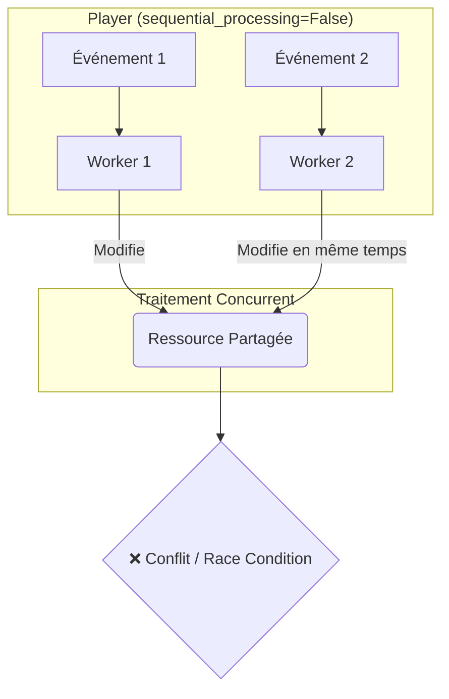
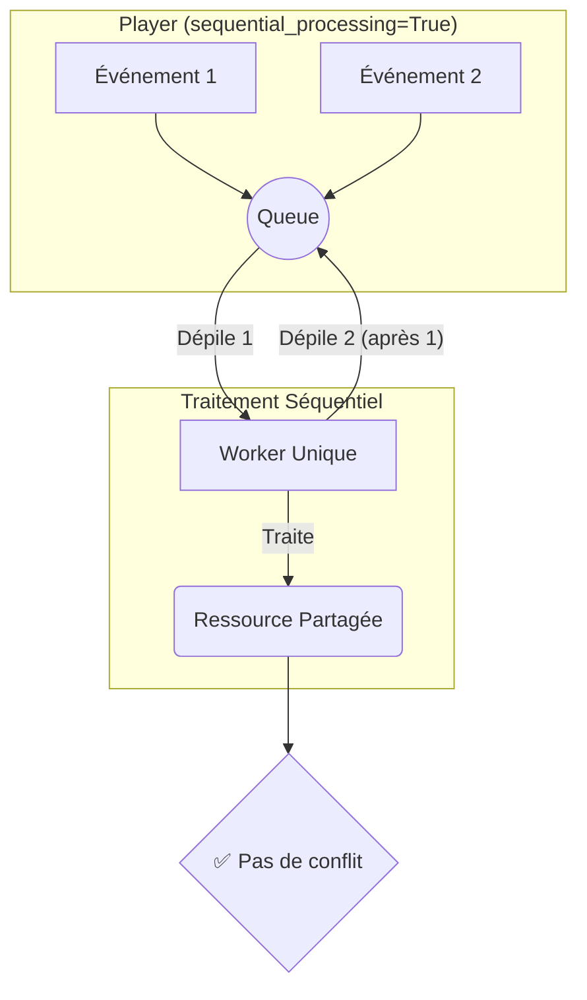

# Documentation de `sequential_processing`

Le paramètre `sequential_processing` est une option qui peut être activée lors de l'initialisation du `Player`.

## Le problème : Les "Race Conditions"

Quand plusieurs opérations (événements) tentent d'accéder et de modifier la même ressource partagée (par exemple, une variable, un fichier, une base de données) en même
temps, l'ordre dans lequel elles s'exécutent peut mener à des résultats inattendus et incorrects. C'est ce qu'on appelle une "race condition".

### Comportement par défaut (`sequential_processing=False`)

Par défaut, le `Player` traite les événements de manière concurrente. Si deux événements arrivent presque en même temps, deux workers peuvent essayer de les traiter
simultanément, créant un risque de conflit.



## La solution : `sequential_processing=True`

Lorsque `sequential_processing` est activé, le `Player` utilise une file d'attente pour s'assurer qu'un seul événement est traité à la fois.

### Fonctionnement avec la file d'attente (Queue)

1. **Mise en file d'attente** : Lorsqu'un événement arrive, il est ajouté à la fin d'une file d'attente (structure "premier entré, premier sorti" ou FIFO).
2. **Traitement Séquentiel** : Un unique "worker" prend les événements de la file, un par un. Il attend que le traitement d'un événement soit terminé avant de passer au
   suivant.

Ce mécanisme garantit l'ordre et élimine les conflits.



## Avantages de `sequential_processing=True`

- **Garantit l'ordre de traitement** : Les événements sont traités un par un, dans l'ordre d'arrivée.
- **Évite les race conditions** : Le traitement séquentiel élimine les risques de conflits.
- **Simplifie le développement** : Pas besoin de mécanismes de verrouillage complexes pour gérer la concurrence.

## Exemple d'utilisation

```python
from python_pubsub_devtools_consumers.player_proxy import PlayerProxy

player = PlayerProxy(
    message_handler=my_message_handler,
    sequential_processing=True  # ✅ Garantit l'ordre et évite les race conditions
)
```
